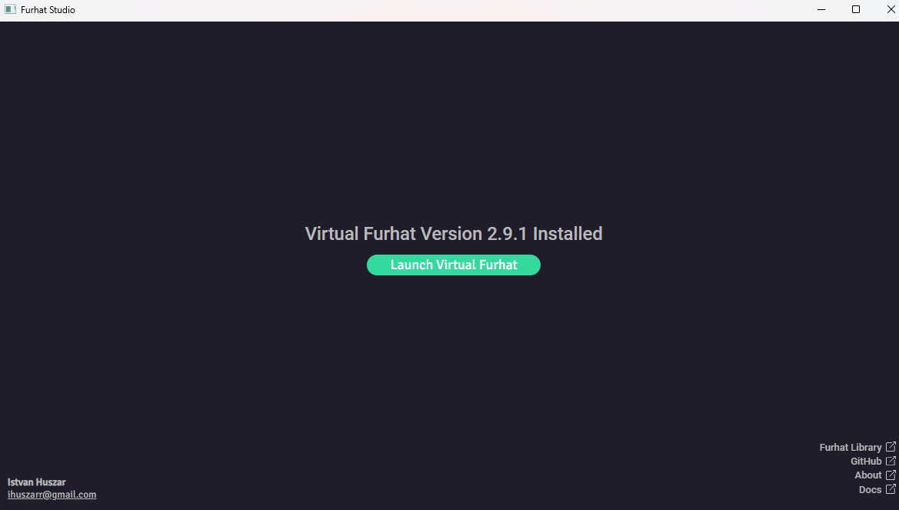
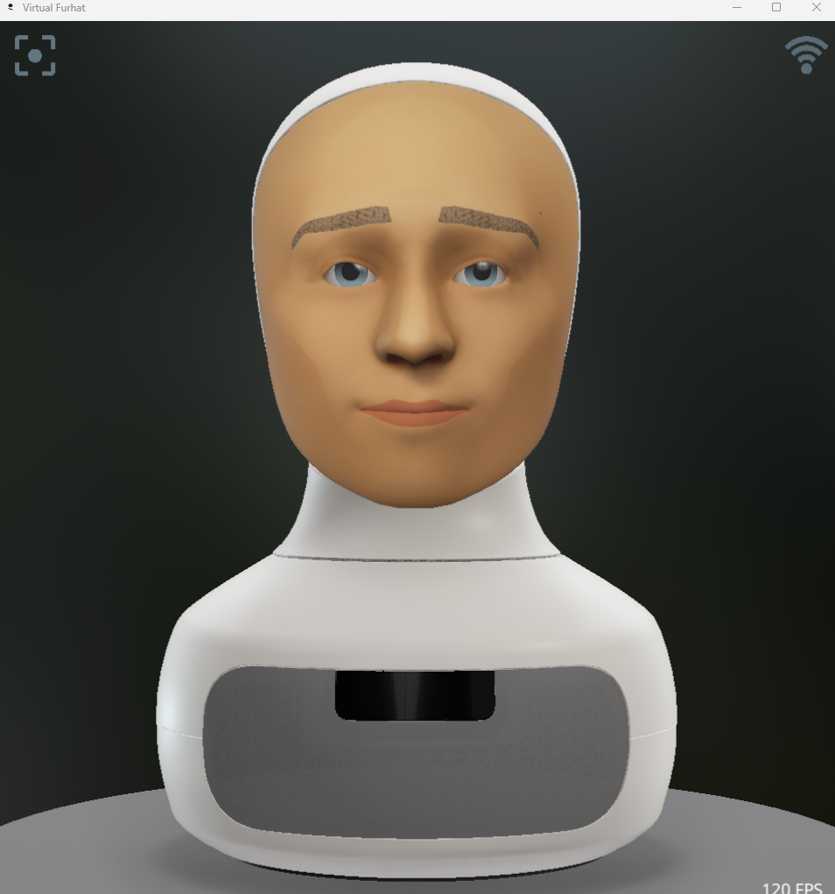
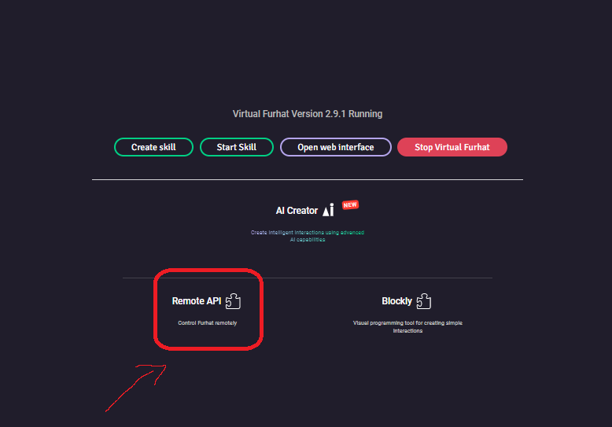
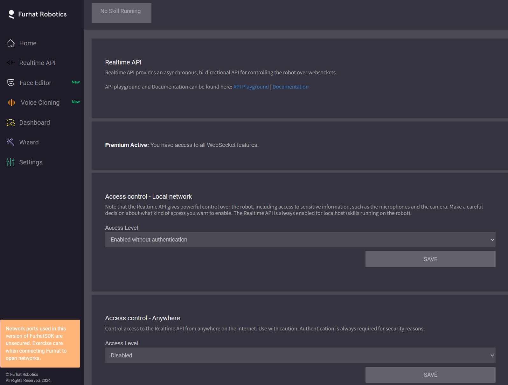

# Social Robots : Furhat Project

## 1. Request Developer Access
You cannot create an account directly; you must request an invite to the Developer Zone.

1.  Navigate to the [Furhat Request SDK page](https://www.furhatrobotics.com/requestsdk).
2.  Fill out the form with your details and usage intent.
3.  Wait for an invitation email from `furhat.io`.
4.  Click the activation link in the email to set your password.

## 2. Generate API Token
To authorize the SDK Launcher on your desktop, you need an API token from the Developer Zone.

1.  Log in to [furhat.io/login](https://furhat.io/login).
2.  Navigate to your **Profile** (top right menu).
3.  Scroll down to the **Furhat API Token** section.
4.  Copy the token string to your clipboard.

## 3. Authenticate the Launcher
1.  Open the **Furhat SDK Launcher** application on your computer.
2.  When prompted, paste the **API Token** you copied in the previous step.
3.  The Launcher will verify the token and unlock the download/run capabilities.

## 4. Accessing the Virtual Robot (Web Interface)

Launch the Virtual Furhat, clicking on the green button, and a virtual image will pop-up


Once the SDK is running a virtual robot, you will access the dashboard via your browser.

* **URL:** `http://localhost:8080`
* **Default Username:** `admin`
* **Default Password:** `admin`

# Running Python code

Skills are generally created in kotlin for Furhat, but if you want to run python code there are multiple solutions:

1. The realtime API, which is old version of the control library
2. The remote API, which is the newest version of the control library also supports async stuff.

In order to make the code run, the robot has to have a skill running that listens to a port to recieve the API call's made in python. In simulation to do that, you just click on the remote API buton:



Also you might need to set up new passwords for auth, or change this to authenticate without credentials, i dunno i didn't test it, just change it that way:



#### Creating a venv
```bash
python -m venv .venv
```

#### Activating it on windows 

```bash
cd .venv/Scripts/
./activate
```

#### If windows throws some error when trying to activate the venv, run this in admin PowerShell:
```bash
Set-ExecutionPolicy RemoteSigned -Scope CurrentUser
```

#### Install Requirements

```
pip install -r requirements.txt
```

## How do i clone this repo?
Install [git](https://git-scm.com/install/) to your laptop beforehand.
[Cloning of the repo](https://docs.github.com/en/repositories/creating-and-managing-repositories/cloning-a-repository)


## How do i run it?

Use cd into the root of the project and then just run the following command in the terminal, after the .venv is activated.

``` 
python robot.py 
```
